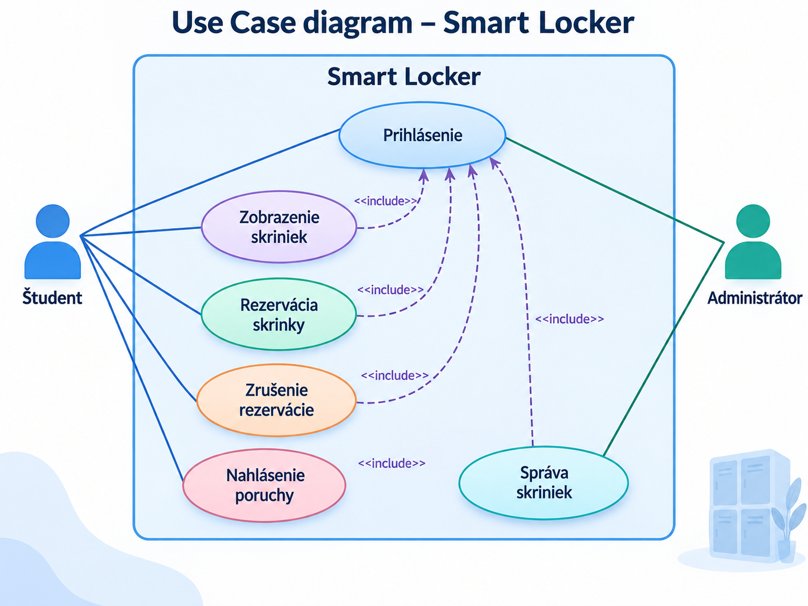
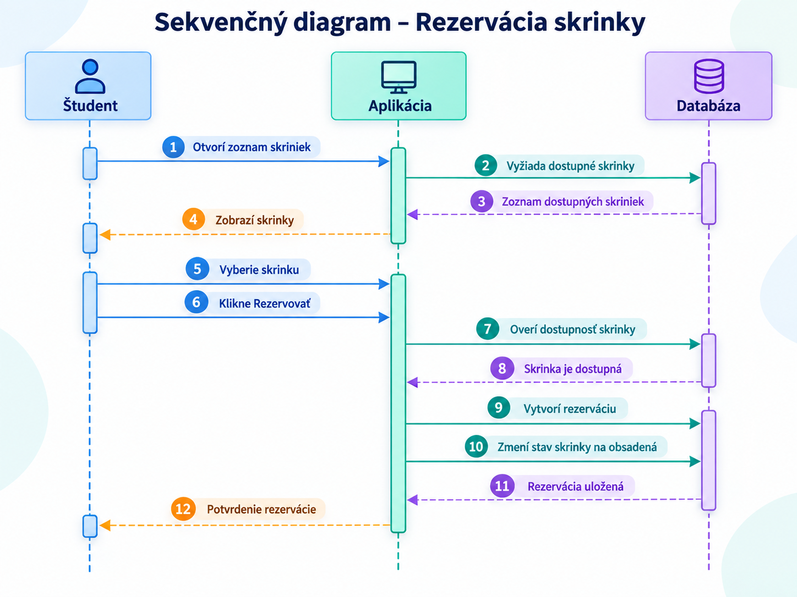
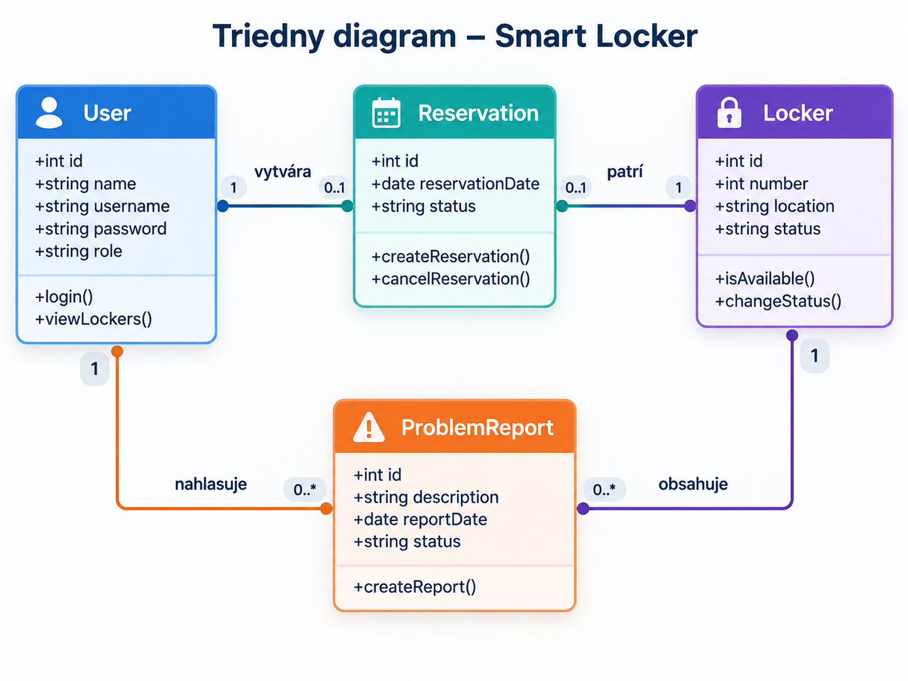

# Systémová analýza – Smart Locker

**Názov projektu:** Smart Locker – systém rezervácie školských skriniek
**Meno riešiteľa:** Matúš Turiak

---

## Dôvod a okolnosti zavedenia riešenia

Projekt vznikol s cieľom vytvoriť jednoduchý digitálny systém na správu a rezerváciu školských skriniek.

V školách sa skrinky často prideľujú manuálne a nie vždy je jednoduché zistiť, ktoré skrinky sú voľné, komu patria alebo či nie je niektorá poškodená.

Cieľom projektu je vytvoriť prehľadnú aplikáciu, pomocou ktorej si môže študent vyhľadať voľnú skrinku, rezervovať si ju a následne sledovať stav svojej rezervácie.

Systém zároveň umožní administrátorovi spravovať jednotlivé skrinky a riešiť prípadné problémy.

---

## Slovné zadanie, popis projektu od zákazníka

Cieľom projektu je vytvoriť jednoduchý systém pre správu školských skriniek.

Používateľ sa po prihlásení dostane na hlavnú obrazovku, kde uvidí zoznam dostupných skriniek a ich aktuálny stav.

Študent si bude môcť vybrať voľnú skrinku a vytvoriť rezerváciu. Systém následne uloží informáciu o používateľovi, čísle skrinky a dátume rezervácie.

Používateľ bude mať možnosť svoju rezerváciu zobraziť alebo zrušiť.

Administrátor bude môcť pridávať nové skrinky, meniť ich stav, označiť ich ako poškodené a kontrolovať aktuálne rezervácie.

Používateľské rozhranie má byť jednoduché a zrozumiteľné aj pre používateľa, ktorý aplikáciu používa prvýkrát.

---

## Zoznam modulov projektu a ich významných atribútov

### 1. Modul používateľov

Atribúty:

* meno používateľa
* prihlasovacie meno
* heslo
* typ používateľa
* rezervovaná skrinka

Unikátna identifikácia objektov: `user.id`

### 2. Modul skriniek

Atribúty:

* číslo skrinky
* umiestnenie skrinky
* aktuálny stav
* informácia o dostupnosti

Unikátna identifikácia objektov: `locker.id`

### 3. Modul rezervácií

Atribúty:

* používateľ
* rezervovaná skrinka
* dátum rezervácie
* stav rezervácie

Unikátna identifikácia objektov: `reservation.id`

### 4. Modul hlásenia porúch

Atribúty:

* číslo skrinky
* popis problému
* dátum nahlásenia
* stav riešenia problému

Unikátna identifikácia objektov: `report.id`

### 5. Používateľské rozhranie

Atribúty:

* prihlasovacia obrazovka
* zoznam skriniek
* detail rezervácie
* administračné rozhranie
* ovládacie prvky

Unikátna identifikácia objektov: `screen.id`

---

## Systémové požiadavky FURPS

### 1. Funkčnosť (Functionality – F)

* Používateľ sa môže prihlásiť do systému.
* Používateľ môže zobraziť dostupné skrinky.
* Študent môže rezervovať voľnú skrinku.
* Študent môže zobraziť svoju aktuálnu rezerváciu.
* Študent môže zrušiť rezerváciu.
* Študent môže nahlásiť poškodenú skrinku.
* Administrátor môže pridávať a upravovať skrinky.
* Administrátor môže meniť stav skriniek.
* Systém kontroluje, či je skrinka pred rezerváciou dostupná.

### 2. Vhodnosť k použitiu (Usability – U)

* Používateľské rozhranie musí byť jednoduché a prehľadné.
* Stav každej skrinky musí byť jasne viditeľný.
* Používateľ musí jednoducho nájsť voľnú skrinku.
* Rezervácia skrinky by mala vyžadovať iba niekoľko krokov.
* Aplikáciu bude možné ovládať pomocou myši a klávesnice.

### 3. Spoľahlivosť (Reliability – R)

* Jednu skrinku nemôžu mať súčasne rezervovanú dvaja používatelia.
* Systém musí správne ukladať rezervácie.
* Údaje o používateľovi a skrinke sa nesmú svojvoľne stratiť.
* Nesprávny vstup používateľa nesmie spôsobiť pád aplikácie.
* Systém musí správne zobrazovať aktuálny stav skriniek.

### 4. Výkon (Performance – P)

* Zoznam skriniek sa musí načítať bez výrazného oneskorenia.
* Vytvorenie rezervácie musí byť vykonané prakticky okamžite.
* Aplikácia nebude vyžadovať výkonný počítač.
* Systém musí byť schopný pracovať s viacerými používateľmi.

### 5. Schopnosť údržby (Supportability – S)

* Do systému bude možné jednoducho pridávať nové skrinky.
* Bude možné meniť údaje existujúcich skriniek.
* Jednotlivé časti aplikácie budú rozdelené do samostatných modulov.
* Systém bude možné v budúcnosti rozšíriť o ďalšie funkcie.
* Chyby bude možné opraviť bez potreby meniť celý systém.

---

## Kritické situácie

### 1. Systémové

* Chyba pri načítaní zoznamu skriniek.
* Chyba pri ukladaní rezervácie.
* Výpadok databázy.
* Používateľ stratí pripojenie počas vytvárania rezervácie.
* Systém nesprávne zobrazí stav skrinky.

### 2. Aplikačné

* Používateľ sa pokúsi rezervovať už obsadenú skrinku.
* Používateľ sa pokúsi rezervovať viac ako jednu skrinku.
* Používateľ zadá nesprávne prihlasovacie údaje.
* Používateľ sa pokúsi rezervovať poškodenú skrinku.
* Používateľ odošle neúplné hlásenie poruchy.

---

## Tri situácie definujúce hranice systému

### 1. Ideálny scenár

Používateľ sa úspešne prihlási do systému, zobrazí zoznam skriniek, vyberie si voľnú skrinku a vytvorí rezerváciu.

Systém rezerváciu uloží a skrinku označí ako obsadenú.

Používateľ následne vidí číslo svojej rezervovanej skrinky vo svojom profile.

### 2. Hranične riešiteľný scenár

Používateľ si vyberie skrinku, ktorá bola medzičasom rezervovaná iným používateľom.

Systém ho upozorní, že skrinka už nie je dostupná, obnoví zoznam skriniek a umožní mu vybrať inú voľnú skrinku.

### 3. Situácie, ktoré aplikácia nezvládne

Ak dôjde k úplnému výpadku servera alebo databázy, systém nebude schopný zobraziť aktuálne údaje ani vytvárať nové rezervácie.

Používateľ bude musieť počkať na obnovenie systému.

---

## Kontext prostredia

Aplikácia bude fungovať ako jednoduchá webová aplikácia dostupná prostredníctvom internetového prehliadača.

Používateľ nebude potrebovať žiadny špeciálny hardvér.

Systém bude pozostávať z používateľského rozhrania, aplikačnej logiky a databázy, v ktorej sa budú ukladať informácie o používateľoch, skrinkách a rezerváciách.

Aplikáciu bude možné používať na počítači alebo notebooku a prípadne aj na mobilnom zariadení.

---

## Charakteristika aktérov a prostredia

### Aktéri

**Študent**

Študent používa aplikáciu na zobrazenie voľných skriniek, vytvorenie rezervácie, zrušenie rezervácie a nahlásenie problému so skrinkou.

**Administrátor**

Administrátor spravuje systém. Môže pridávať alebo upravovať skrinky, meniť ich stav a kontrolovať rezervácie a hlásenia problémov.

### Prostredie

* počítač alebo notebook
* internetový prehliadač
* webová aplikácia
* databáza

---

## Use Case diagram

Hlavné prípady použitia systému:

* Prihlásenie
* Zobrazenie skriniek
* Rezervácia skrinky
* Zrušenie rezervácie
* Nahlásenie poruchy
* Správa skriniek

---

## Scenáre – konkrétna implementácia Use Case

### 1. Rezervácia skrinky

**Názov:** Rezervácia školskej skrinky

**Kontext:**
Študent si chce rezervovať voľnú školskú skrinku.

**Level zanorenia Use Case:**
Hlavný scenár

**Aktéri:**
Študent, systém

**Stakeholderi a záujmové osoby:**
Študent, administrátor školy

### Vstupné podmienky

* Študent má vytvorený používateľský účet.
* Študent je prihlásený.
* Študent ešte nemá rezervovanú inú skrinku.
* V systéme sa nachádza aspoň jedna voľná skrinka.

### Výstupné podmienky

* Systém vytvorí novú rezerváciu.
* Vybraná skrinka je označená ako obsadená.
* Rezervácia je priradená k používateľovi.

### Minimálny výstup

Systém oznámi používateľovi, či bola rezervácia úspešná alebo neúspešná.

### Ideálny výstup

Používateľ vyberie voľnú skrinku, systém úspešne vytvorí rezerváciu a zobrazí používateľovi potvrdenie s číslom skrinky.

### Hlavný scenár

1. Študent sa prihlási do systému.
2. Otvorí zoznam školských skriniek.
3. Systém zobrazí aktuálne dostupné skrinky.
4. Študent vyberie voľnú skrinku.
5. Klikne na možnosť „Rezervovať“.
6. Systém skontroluje dostupnosť skrinky.
7. Systém skontroluje, či študent ešte nemá inú rezerváciu.
8. Systém vytvorí rezerváciu.
9. Skrinka sa označí ako obsadená.
10. Používateľovi sa zobrazí potvrdenie rezervácie.

### Rozšírenie

* Ak je skrinka už obsadená, systém rezerváciu nevytvorí a zobrazí používateľovi upozornenie.
* Ak už používateľ jednu skrinku rezervovanú má, systém mu nedovolí vytvoriť ďalšiu rezerváciu.
* Ak dôjde k chybe databázy, systém zobrazí chybové hlásenie.
* Ak používateľ rezerváciu zruší, skrinka sa opäť označí ako dostupná.

---

## Sekvenčný diagram

Sekvenčný diagram znázorňuje proces rezervácie skrinky.

---

## Triedny diagram

---

## Záver

Projekt Smart Locker predstavuje jednoduchý informačný systém, ktorý môže zjednodušiť prideľovanie a správu školských skriniek.

Systém umožňuje študentom jednoducho zistiť dostupnosť skriniek, vytvoriť alebo zrušiť rezerváciu a nahlásiť prípadnú poruchu.

Administrátorovi umožňuje udržiavať aktuálne informácie o jednotlivých skrinkách a rezerváciách.

Projekt je navrhnutý tak, aby bol jednoduchý na používanie a zároveň ho bolo možné v budúcnosti rozšíriť napríklad o automatické prideľovanie skriniek, QR kódy, elektronické zámky alebo upozornenia používateľov.

